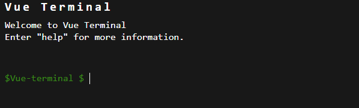

# vue-terminal

## 📁接口
#### banner

terminal的标题栏，如图所示：



``` typescript
banner: {
      type: Object,
      required: false,
      default: () => {
        return {
          header: "Vue Terminal",
          subHeader: "Welcome to Vue Terminal",
          helpHeader: 'Enter "help" for more information.',
          sign: "Vue-terminal $"
        };
      }
    },
```
#### command

自定义的命令，例如下面定义了uname函数，输入uname即可输出

```typescript
commands: any = [
    {
      name: 'uname',
      desc: 'Show the current terminal name',
      get() {
        return navigator.appVersion
      },
    }
  ];
```
### notInput

控制后端无响应时，前端禁止输入框。notinput是一个boolean值，默认为false，禁止输入时要改为true


## 📇TODO
- 🥈按上键光标应该在输入的右边，现在在左边
- ~~🥇输入有输出时，下一个输入光标失去了焦点~~
- ~~🥇输入超过页面高度，不能自动滚动到最底下（本质还是失焦问题，只要每行获得了焦点就没问题）~~
